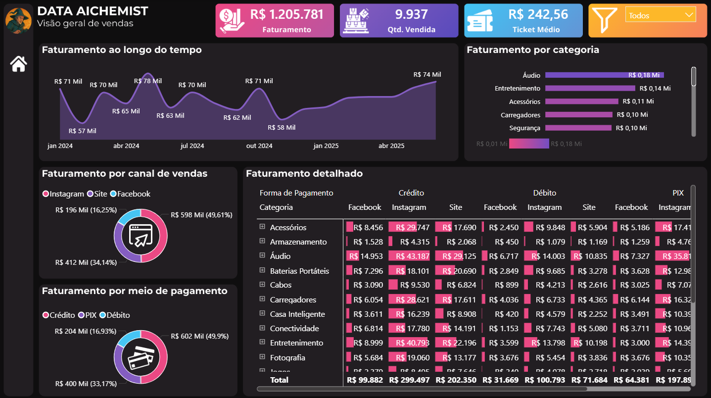

# 📊 Dashboard de Vendas | Power BI

## 🚀 Contexto do Projeto

Durante o curso de Análise e Desenvolvimento de Sistemas, identifiquei a necessidade de sair da teoria e aplicar os conhecimentos na prática.

Este projeto foi desenvolvido com o objetivo de transformar dados brutos de vendas em um dashboard interativo, capaz de gerar insights relevantes para tomada de decisão.

---

## 🎯 Objetivo

Construir um painel analítico que permita:

- Monitorar o desempenho de vendas
- Identificar padrões e tendências
- Apoiar decisões estratégicas com base em dados

---

## 🛠️ Ferramentas Utilizadas

- Power BI  
- Power Query  
- DAX  
- Excel (base de dados)

---

## ⚙️ Etapas do Projeto

### 🔹 1. Tratamento de Dados
- Importação da base de vendas
- Limpeza e transformação utilizando Power Query

### 🔹 2. Modelagem
- Estruturação dos dados para análise
- Criação de métricas e cálculos com DAX

### 🔹 3. Visualização
- Desenvolvimento de dashboard interativo
- Aplicação de filtros dinâmicos e visuais estratégicos

---

## 📊 Dashboard

---

## 🔍 Insights Obtidos

- Identificação dos produtos com maior volume de vendas  
- Análise de variação de faturamento ao longo do tempo  
- Destaque de categorias com melhor desempenho  

---

## 💡 Aprendizados

Este projeto permitiu desenvolver habilidades essenciais como:

- Manipulação e tratamento de dados  
- Construção de dashboards interativos  
- Pensamento analítico aplicado a dados reais  
- Transformação de dados em insights estratégicos  

---

## 🚧 Desafios

Durante o desenvolvimento, enfrentei desafios técnicos relacionados à configuração e modelagem dos dados, que foram superados com estudo e prática.

---

## 🚀 Evolução

Este projeto marca o início da minha jornada prática em Análise de Dados, com foco em evoluir continuamente e desenvolver soluções baseadas em dados.

---

## 📂 Como utilizar

1. Baixe o arquivo `.pbix`
2. Abra no Power BI Desktop

---

## 📌 Créditos

Projeto desenvolvido como parte do meu aprendizado prático, inspirado na metodologia do canal Data Alchemist.

---

## 👨‍💻 Autor

João Andrade  
📊 Focado em Análise de Dados  
